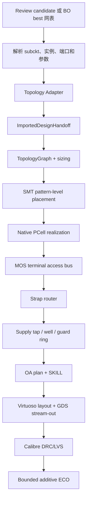

# hn-dev 后端版图生成流程、术语与问题分析

## 1. 文档范围与结论

本文分析对象是本地 `hn-dev` 分支，当前提交为 `761456d`。同时对本地
`master` 分支（提交 `1f30d2a`）做了代码结构对照。

需要先说明：本地 `master` 和 `hn-dev` 没有共同的 Git merge base，属于两套
独立历史，不能简单理解为同一实现的新旧版本。

当前 `hn-dev` 后端已经打通了以下工程链路：

```text
前端最终网表
  -> topology adapter / physical handoff
  -> 设计意图与约束
  -> SMT pattern-level 放置
  -> CRN28 native PCell
  -> 端子 access 几何
  -> strap-style 布线
  -> tap / well / guard ring
  -> Virtuoso OA
  -> GDS
  -> Calibre DRC/LVS
  -> 最多 5 轮 ECO
```

但它目前更接近一个 **topology-specific physical prototype**，还不是成熟的模拟
自动布局布线器。当前三个主要问题是结构性的：

1. 原先 `common_centroid` 只声明意图并降级为 symmetric pair；当前第一阶段修改已把
   OTA 输入差分对下沉为 `Dummy-A-B-B-A-Dummy`，但 native dummy 参数仍待真实
   Calibre DRC/LVS 校准；
2. OTA 使用远离核心的水平长 strap，天然产生长线，并间接放大 guard ring；
3. Python precheck 主要检查连通性，远远不等价于 foundry Calibre DRC；而当前
   ECO 又只能修复少量 additive routing 问题。

---

## 2. 从前端网表到最终 GDS 的完整流程



### 2.1 进入后端前的资格门

统一入口在
`Agent_LLM_BO/circuit_agent/physical_bridge.py::execute_physical_from_state()`。

后端只会在以下条件满足时执行：

- nominal 或 Review candidate 合格；
- Design Audit 没有 blocker；
- 存在真实 `pvt_pass=true` 证据；
- 前端已经选出最终电气网表。

后端不能改变拓扑，也不能重新连接网络。最终电气真值仍是前端选出的网表。

### 2.2 网表解析与 handoff

`analogskills/imported_design/handoff.py::build_imported_design_handoff()` 负责：

1. 读取最终网表和真实 PVT 结果；
2. 调用 topology adapter；
3. 将器件、端口、网络、尺寸、角色、匹配约束写入 `handoff.json`；
4. 保存最终网表快照及 SHA256，保证物理实现对应的是确定的前端版本。

Handoff 中不只是网表，还包含后端需要的语义信息，例如：

- 哪些管是输入差分对；
- 哪些管是电流镜；
- 哪些网络是电源、地、输入、输出和高阻节点；
- 哪些器件应该匹配或对称；
- 哪些网络应该匹配布线或优先使用某一层。

### 2.3 网表到 TopologyGraph

`analogskills/imported_design/flow.py::compile_imported_design()` 把 handoff 转换成：

- `TopologyGraph`：器件、端子、网络和端口连接关系；
- `sizing`：每个器件的 `W/L/nf/m/R/C` 等参数；
- `LayoutConstraintSet`：matched group、symmetry group、routing constraint、
  critical net。

这一层是电路连接世界和物理约束世界之间的桥梁。

### 2.4 放置与 PCell

对于 `two_stage_ota`，默认调用
`analogskills/imported_design/physical_intent.py::solve_imported_physical_smt()`。

流程是：

1. 用一次 PCell probe 估计每个逻辑器件的物理 bbox；
2. 把器件组织成若干 pattern；
3. 用 Z3 求解各 pattern 的位置和候选形态；
4. 得到每个器件的 `(x, y, orientation)`；
5. 调用 `analogskills/pcell/generation.py::generate_pcell_layout_plan()` 生成
   CRN28 native PCell 计划；
6. 再生成校准后的 MOS gate/source/drain/body access bus。

最终 MOS 使用 `tsmcN28` 库中的 `nch_mac/pch_mac`，不是用矩形伪造的 MOS。

### 2.5 布线、tap、well 和 guard ring

OTA 走专用函数
`analogskills/imported_design/flow.py::_build_imported_two_stage_ota_layout()`：

1. 为每个网络分配 route layer 和水平 lane；
2. 在核心上方生成每个网络的水平 strap；
3. 把 PCell terminal access 通过 fanout、drop 和 via stack 连到 strap；
4. 生成 VDD nwell tap 和 VSS substrate tap；
5. 生成 well region；
6. 围绕当前完整版图 bbox 生成 guard ring；
7. 用 M1 bridge 把 guard ring 接到 VSS。

`strongarm_latch` 当前不是这套 OTA SMT physical policy。它从固定 seed placement
开始，随后调用通用 `generate_interconnect()`、power rail、tap、well 和 guard ring
流程。因此讨论具体问题时必须区分 OTA 和 StrongARM 两条路径。

### 2.6 OA、GDS 与 Calibre

版图先保存为 `layout.oa_plan.json`，然后生成 SKILL：

- `oa/layout.il`：写 layout；
- `oa/schematic.il`：写 schematic；
- `oa/write_all.il`：在 Virtuoso session 中执行两者；
- `oa/streamout.il`：stream-out GDS。

同时根据逻辑图导出 source CDL，供 Calibre LVS 使用。

Calibre sign-off 后：

- DRC violation 为 0；
- LVS issue 为 0；
- GDS 非空；

三个条件同时满足，`physical_state.json` 才能标为 `done`。

---

## 3. Adapter 到底是什么

### 3.1 软件工程中 adapter 的一般含义

Adapter 即“适配器”：把一套接口或数据表达转换成另一套接口或表达，使原本不
直接兼容的两部分能够连接。

它通常不负责完整算法，而负责：

- 翻译字段和命名；
- 校验输入是否符合预期；
- 补充目标系统需要的语义；
- 隔离上下游实现差异。

### 3.2 本项目中的 OTA adapter

这里说的 OTA adapter 主要指：

`analogskills/imported_design/adapters.py::_adapt_two_stage()`。

它接收前端解析出的器件和端口，执行以下工作：

1. 要求器件名称必须精确等于：
   `Mbias/Mdiff1/Mdiff2/Mmirr1/Mmirr2/Mtail/Mcs/Mload/Rz/Cc`；
2. 要求端口精确等于：
   `vip/vin/vout/ibias/vdd/vss`；
3. 检查关键器件的节点连接；
4. 把 `Mdiff1/Mdiff2` 标为输入对；
5. 把 `Mmirr1/Mmirr2` 标为电流镜；
6. 声明 matched group、symmetry group、critical net 和 routing intent。

它的作用可以概括为：

> 把“一个普通 Spectre 两级 OTA 网表”翻译成“后端认识的两级 OTA 物理语义”。

如果器件名、端口或连接发生变化，adapter 会返回
`physical_adapter_required`，而不是猜测新结构。

### 3.3 “还有一个 adapter 脚本”是什么

仓库中确实存在 `analogskills/imported_design/adapters.py`，其中同时包含：

- `adapt_topology()`：总入口；
- `_adapt_two_stage()`：两级 OTA adapter；
- `_adapt_strongarm()`：StrongARM adapter。

此外项目中还会把别的接口桥接代码称为 adapter，例如 EDA backend adapter、PDK
adapter。但它们和这里的 topology adapter 不是同一个东西，只是采用了相同的
软件设计术语。

还要区分两个层次：

- `adapters.py`：把网表翻译成角色和约束；
- `_build_imported_two_stage_ota_layout()`：真正执行 OTA 专用布线、tap、well 和
  guard ring 的 physical implementation。

因此“OTA physical adapter”有时会泛指这两部分合起来的 OTA 专用后端路径。

---

## 4. Spectre m/nf 的原实现与第一阶段修正

`hn-dev` 提交 `761456d` 的原逻辑位于
`analogskills/imported_design/flow.py::_physical_pcell_sizing()`：

```text
W_physical  = W_original  * m
nf_physical = nf_original * m
m_physical  = 1
```

例如网表中：

```text
W=10um, nf=2, m=4
```

当前物理实现会变成近似：

```text
W=40um, nf=8, m=1
```

单指宽度仍为 `40/8 = 5um`，总有效宽度仍为 `40um`。因此对理想 DC 电流和总
有效宽度来说，二者可以近似等价。

### 4.1 当前实现这样做的原因

代码注释给出的目的，是把 Spectre multiplicity 折叠进 native PCell fingers，
使：

- OA 中存在明确的物理 fingers；
- source CDL 可以按 finger 展开；
- Calibre extraction 看到的物理器件数与 LVS source object space 更容易对齐；
- 避免 native PCell 的 `simM` 只影响仿真参数、却没有生成对应物理几何。

这是一个为了早期 LVS/提取闭环采取的简化策略。

### 4.2 m 和 nf 实际上不是同一个物理概念

用户希望“`m` 就是 `m`，`nf` 就是 `nf`”是合理的，而且从精确物理语义看应当
如此：

- `nf`：一个 MOS 实例内部有多少个 gate fingers，通常允许共享扩散；
- `m`：多少个相同 MOS 实例并联，原则上是多个独立实例或多个独立 unit；
- `W`：通常表示该实例的总宽度，具体还要遵循 PDK/Spectre 模型定义。

把 `m` 合并到 `nf` 可能改变：

- diffusion sharing；
- source/drain 周长和面积；
- gate resistance；
- 接触孔数量；
- 寄生电阻、电容；
- mismatch 和梯度敏感性；
- common-centroid 的可分割单元数量；
- 最终 extraction 的器件组织形式。

所以它只能保证一阶总宽度近似一致，不能保证后仿和匹配行为严格等价。

### 4.3 第一阶段已经采用的严格 m/nf 物理语义

第一阶段修改已经改为：

```text
逻辑器件 M1: W=10um, nf=2, m=4

物理 realization:
  M1_u0: W=10um, nf=2
  M1_u1: W=10um, nf=2
  M1_u2: W=10um, nf=2
  M1_u3: W=10um, nf=2
```

当前已经实现：

- 顶层 sizing 中原始 `W/nf/m` 不再被改写；
- 当 `m>1` 时生成 `mos_unit_array` realization；
- OA 中生成 `m` 个显式 unit PCell，每个 unit 使用原始 `W/nf` 且 `m=1`；
- source CDL/LVS 按相同 unit-array abstraction 展开；
- `instance_mapping.json` 记录 requested `m/nf`、OA unit 和 LVS instance；
- unit-array 暂时使用单行排列，避免未建模的纵向 terminal-access envelope 相交。

后续 matched-array 阶段仍需完成：

- placement 在多个 unit PCell 上实现 interdigitation/common-centroid；
- routing 显式并联同名端子；
- source CDL/LVS mapping 记录一个逻辑器件到多个物理器件的映射；
- extraction 按 PDK 规则决定最终是否可以 parallel reduce。

如果 native PCell 的 `simM` 确实会生成独立、可提取的物理单元，也可以直接保留
`m`；但这一点必须由独立 PCell OA/GDS/Calibre probe 验证，不能只根据参数名
推断。

因此原折叠行为不应被看成电路理论要求，而是早期后端为简化 LVS realization 做出的
工程选择；当前第一阶段已经移除该折叠。

---

## 5. Z3、SMT 和 pattern-level placement 是什么

### 5.1 SMT 是哪类算法

SMT 是 **Satisfiability Modulo Theories**，中文常译为“可满足性模理论”。

它解决的问题不是传统连续优化，而是：

> 给定一组逻辑、整数、实数、顺序和几何约束，是否存在同时满足这些约束的变量取值？

在版图放置中，可以定义：

- `x_A, y_A`：模块 A 的位置；
- `x_B, y_B`：模块 B 的位置；
- `A` 必须在 `B` 左边；
- `A/B` 不能重叠；
- 两个差分器件必须同一行；
- 所有坐标必须落在制造网格上；
- 在满足硬约束的解里最小化 bbox、HPWL 和不对齐程度。

### 5.2 Z3 是什么

Z3 是 Microsoft Research 开发的 SMT solver。SMT 是问题类型/理论框架，Z3 是
本项目实际调用的求解器软件。

所以准确说法是：

- SMT：约束求解方法；
- Z3：执行求解的软件；
- 本项目的 `analog_smt_compiler.py`：把版图 DSL 编译为 Z3 变量、约束和目标。

### 5.3 什么是 pattern

Pattern 是一组应该作为局部结构一起处理的器件。例如 OTA 当前定义了：

| Pattern | 器件 | 意图 |
|---|---|---|
| `input_pair` | Mdiff1, Mdiff2 | 输入差分对 |
| `mirror_pair` | Mmirr1, Mmirr2 | 电流镜负载 |
| `tail_bias` | Mbias, Mtail | 偏置与尾管 |
| `second_stage` | Mload, Mcs | 第二级 |
| `compensation` | Rz, Cc | 补偿支路 |

### 5.4 pattern-level placement 做什么

Pattern-level placement 分两层处理：

1. 先决定 pattern 内部器件顺序、行列和相对偏移；
2. 再把每个 pattern 当作一个矩形 macro，求解 pattern 之间的相对位置。

它优化的是：

- pattern bbox；
- pattern 的上下/左右关系；
- pattern 中心对齐；
- 整体面积和宽高比；
- 基于器件中心估算的 HPWL。

当前 OTA 不是在 OD、PO 或 unit transistor polygon 级别求解。它只放置完整 PCell
bbox，所以即使写了 `common_centroid` 意图，也不会自动得到 `A-B-B-A` 单元阵列。

### 5.5 当前 Z3 还用于 route resource assignment

除了 placement，当前代码还用另一个 Z3 `Solver` 给每个网络分配：

- 一个 route layer；
- 一个水平 lane 编号。

它保证：

- 所有网络的 lane 不重复；
- `vip/vin` 在同一层；
- `vip/vin` lane 相邻；
- `vout/vss` 可以被限制到 M4。

但这里没有真正求解整条二维/三维 wire path，也没有最小化最终线长。它只是分配
抽象布线资源，真正的几何仍由后续 strap router 生成。

---

## 6. 布线术语解释

### 6.1 Track 与 lane

**Track** 是布线网格中的一条合法中心线，通常由 PDK 的 routing pitch 定义。

**Lane** 在当前 OTA 实现中是更高层的逻辑水平通道编号。实际 y 坐标为：

```text
strap_y = strap_y_start + lane * strap_y_pitch
```

当前：

```text
strap_y_start = core_top + 27um
strap_y_pitch = 3um
lane          = 0...11
```

所以这里的 lane 并不严格等同于 PDK 的一根细 metal track，而是人为预留的宽间距
水平布线走廊。

### 6.2 Strap

Strap 是一条较长的金属主干。当前每个 global net 会生成一条水平 strap，跨度从
该网络最左端连接点延伸到最右端连接点。

可以把它想象成一条水平公交主干线：所有属于该 net 的器件端子都要接到这条主干。

它的优点是结构简单、容易检查连通性；缺点是小型模拟电路中可能产生大量不必要的
长线和寄生。

### 6.3 Trunk、rail 与 bus

- **Trunk**：一个网络的主干，strap 是 trunk 的一种实现；
- **Power rail**：专门承载 VDD/VSS 的电源主干；
- **Bus**：一组并行信号，或一个器件多指/多 unit 的同端子公共连接条；
- **Terminal access bus**：把 native PCell 内部多个 finger 的 G/S/D/B 引到统一可接入位置的局部金属条。

### 6.4 Fanout

Fanout 是从器件端子或局部 access bus 向外引出的一小段布线。

它的目的通常是：

- 离开拥挤的 PCell 边缘；
- 避开相邻端子和 via；
- 到达一个更适合向全局 strap 连接的位置。

### 6.5 Drop

Drop 是从水平 strap 向器件方向下落的支路。当前 OTA 通常用 M2 做 drop，再通过
via stack 与 M3/M4 strap 和 M1/M2 terminal access 相连。

### 6.6 Via 与 via stack

Via 是连接相邻两层金属的通孔，例如：

- VIA1：M1 ↔ M2；
- VIA2：M2 ↔ M3；
- VIA3：M3 ↔ M4。

如果一个 M1 terminal 要接到 M4 strap，就需要：

```text
M1 -> VIA1 -> M2 -> VIA2 -> M3 -> VIA3 -> M4
```

这一串 via 叫 via stack。

### 6.7 Via landing

Via landing 是 via 上下层用于包围 via cut 的金属区域。它必须满足 enclosure、
min-area 和 spacing 规则。很多 DRC 并不是 via cut 本身错误，而是 landing 太小、
与邻网太近或产生短 jog。

### 6.8 Maze escape

简单 fanout 如果遇到障碍，router 会在局部网格中搜索一条绕开障碍的路径。因为
搜索过程类似在迷宫中找路，所以叫 maze routing/maze escape。

当前实现只把它当作 terminal 到 strap 的局部补救策略，不是全芯片级成熟 maze
router。搜索窗口和 expansion 数量都是有界的。

### 6.9 Global net 与 local net

- **Local net**：通常只有两个相邻端子、距离短，可以在器件附近直接连接；
- **Global net**：跨越多个器件或连接 top-level pin，需要使用主干和多个分支。

当前 OTA 设置 `local_net_prefixes=()`，使原本可以局部短接的内部网络也更容易进入
全局 strap 体系，这是长线问题的一个来源。

---

## 7. 当前 OTA 的金属选择策略

CRN28 profile 定义 M1 到 M10，并声明：

| 层 | PDK 偏好方向/角色 | 当前 OTA 用法 |
|---|---|---|
| M1 | horizontal / mixed | PCell 本地 access、body、guard ring bridge |
| M2 | vertical / mixed | terminal drop、本地 source/drain bus |
| M3 | horizontal / signal | 全局水平 strap |
| M4 | vertical / signal | 仍被用于全局水平 strap；vout/vss 偏好或强制使用 |
| M5+ | 多数偏 power | 当前 OTA route-resource solve 不使用 |

具体规则为：

- route-resource solver 只使用 `M3/M4`；
- `vout` 和 `vss` 优先/强制使用 M4；
- 其他网络可以选 M3 或 M4；
- 所有网络的 channel orientation 都写成 horizontal；
- terminal drop 固定使用 M2。

因此当前有一个明显不一致：PDK 把 M4 定义为垂直偏好层，OTA 却在 M4 上生成水平
strap。它未必直接构成硬 DRC，但会造成布线不自然、via stack 增多和局部拥塞。

---

## 8. 三类现有问题的代码根因

### 8.1 差分对原先没有真正共质心；当前已生成 ABBA 首版

Adapter 声明：

```text
style = common_centroid
require_dummies = true
```

原 physical intent 只创建两个完整 PCell 的 row pattern，并且曾经设置：

```text
mirror_right = false
same_y       = true
```

第一阶段先把差分对和镜像负载的右侧器件改为 `mirror_right=true`。随后 OTA 输入对已
进一步下沉为四个显式有源单元：

```text
native dummy | Mdiff1_u0 | Mdiff2_u0 | Mdiff2_u1 | Mdiff1_u1 | native dummy
role         | A         | B         | B         | A         |
orientation  | R0        | R0        | MY        | MY        |
```

两个 A 单元并联并映射回逻辑 `Mdiff1`，两个 B 单元并联并映射回逻辑 `Mdiff2`；每个
物理单元使用一半逻辑 W，保留源网表的 nf，`m=1`，所以没有把 Spectre `m` 折叠进
W 或 nf。外侧 dummy 通过最外侧 A PCell 的 `leftDummyPoly/rightDummyPoly` 实现，
不是额外的有效 MOS，也不会写进 source CDL。

该结构现在报告为：

```text
requested_style = common_centroid
realized_style  = common_centroid_abba
status          = realized
calibre_qualification = pending
```

`status=realized` 表示 ABBA 几何和逻辑到物理 unit mapping 已生成，因此允许进入
sign-off；`calibre_qualification=pending` 表示 CRN28 native dummy CDF 参数尚无本次
服务器 Calibre 零错误证据。最终合格状态仍只由真实 DRC/LVS 决定，不能把
`constraint_realization_complete` 误用成 Calibre 前置门槛。

输入差分对仍缺失或尚未验证的能力包括：

- 相同的 OD/PO/implant 邻接环境；
- 对称 terminal access；
- 差分网络等长、等层、等 via 数；
- 对称 guard/well 环境；
- 必要时共享扩散。

另外，`n_tail` 已先对同一行的四个差分对 source access 生成 M2 局部汇流，再逃逸到
全局 strap；tail/input/mirror 三行的中心对齐也已从软目标改为硬约束，避免尾管漂移
造成长线。二维 centroid、电流镜 interdigitation 和真实 Calibre 校准仍属于后续工作。

### 8.2 长走线与超大 guard ring

当前 OTA 硬编码：

```text
route_y = core_top  + 27um
pin_x   = core_left - 29um
lane pitch = 3um
```

每个网络还必须独占 lane。因此：

- 第一条 strap 已经远离核心；
- 后续网络继续向上排列；
- top-level pin 被统一拉到核心左侧；
- 局部网络也可能走全局 strap；
- solver 没有优化最终 Steiner length、via 数或实际 RC。

Guard ring 又不是只围晶体管 core，而是围 `with_wells` 的完整物理 bbox。该 bbox
已经包含远处 strap、pin、via 和 tap。因此 route 越大，guard ring 就越大。

更合理的 floorplan 应分别维护：

- device core bbox；
- local routing bbox；
- top-level pin/IO corridor；
- guard-ring anchor bbox。

Guard ring 应优先围绕需要隔离的器件 core/well，而不是盲目包围所有远端 routing。

### 8.3 大量 DRC

没有具体 Calibre report 时不能精确给出 rule-ID 级根因。当前第二阶段已经把可由本地
PDK JSON 明确证明的规则接入最终 `physical_precheck`：

- path/rect/pin 的 minimum width；
- 同网同层连通图形并集的 minimum area；
- 不同网络同层图形的 minimum spacing；
- via 在上下金属层的 landing/enclosure，支持多个相邻同网图形联合覆盖；
- 所有检查结果、rule/bbox/source 和未覆盖规则类别写入
  `physical_precheck_stages.json -> final_with_pins.local_drc`。

同时生成器现在会显式落下 `required_via_landing_pad`，而不是只在碰撞分析中假设 landing
存在；global router 也读取 CRN28 最小间距，并把已有 local-route 图形作为障碍。

`n_tail` 和 `n_mirr` 已从全局 strap 中移除：核心内部端子通过 VIA1/VIA2 上到 M3，
在 M3 内用有界逐行模板汇流。这样避免了原先多根 M2 竖线穿过相邻 drain/source
access 的 spacing/short 风险，也避免依赖昂贵且不稳定的通用 maze search。

仍然存在以下只能由 Calibre 或更多 PDK metadata 判断的高风险：

1. PDK JSON 只有部分基础规则，Calibre deck 包含更多 context-dependent rule；
2. router 主要看 terminal access 和抽象 owned shapes，不一定掌握 native PCell 内部
   全部 mask geometry；
3. context-dependent EOL/notch、multi-patterning color、density/fill 和 antenna 尚未覆盖；
4. native PCell 内部 FEOL、latch-up 和完整 guard-ring context 尚未覆盖；
5. M4 水平 strap 与 PDK preferred direction 冲突；
6. guard ring 是通用四边矩形生成器，没有完整 corner/well/implant-aware legalization；
7. 当前 ECO 主要是 additive repair，不能移动、删除、缩短或换层重布。

当前 ECO 能安全处理的主要是：

- min-area fill；
- width fill；
- same-net jog/spacing fill；
- contact enclosure 补形；
- 添加冗余 via。

它不能处理：

- 器件间距需要重新放置；
- common-centroid 重排；
- 长线需要删除和重布；
- guard ring 需要缩小或移动；
- well/implant 大范围结构错误；
- 需要修改 native PCell 的错误。

所以首版版图存在大量结构性 DRC 时，最多 5 轮 additive ECO 不可能稳定收敛。

---

## 9. 当前后端是不是让 agent 调用很多小工具

### 9.1 hn-dev 当前统一物理流程

答案是：**不是，至少当前主执行路径不是。**

`hn-dev` 仓库里确实有很多模块和小工具，例如：

- SMT placement；
- PCell calibration；
- terminal access；
- strap router；
- A*/negotiated routing；
- connectivity analyzer；
- DRC marker parser；
- local ECO solver；
- layout observation/aesthetic feedback。

但是 `run_full_flow.py -> physical_bridge.py -> imported_design/flow.py` 这条当前统一路径
没有让 LLM/agent 在运行时自由判断“现在应该调用哪个工具”。工具调用顺序和参数基本
已经写死在 Python flow 中：

```text
SMT placement
  -> PCell
  -> access
  -> strap route
  -> tap/well/guard
  -> connectivity precheck
  -> OA/GDS
  -> Calibre
  -> rule-based bounded ECO
```

运行中的“判断”主要是普通程序判断：

- topology 是否受支持；
- SMT 是否 SAT；
- 是否存在 open/short；
- Calibre marker 属于哪一类；
- 是否有安全 additive patch；
- patch 后 DRC/LVS 数量是否严格改善且不退化。

这些是 deterministic/rule-based orchestration，不是 agent 观察版图后进行开放式规划。

### 9.2 master 分支是否采用 agent + 小工具模式

`master` 更接近这种设计理念，但仍要准确区分。

`master` 包含更完整的“agent-ready toolbox”：

- `analogskills/layout/layout_observation.py`：把 SMT、routing、connectivity、OA 几何
  整理成事实 observation，明确供 agent 分析；
- `analogskills/layout/aesthetic_feedback.py`：从版图指标生成 tweak 候选；
- `analogskills/detail_route_repair_runner.py`：生成有限域局部修复 proposal；
- `analogskills/design_intent_dsl.py` / `design_intent_flow.py`：把设计意图、solver、
  evaluator 和 tool recommendation 组织为 contract；
- `analogskills/knowledge/llm_prompt_templates.md`：指导 LLM 根据 Calibre marker、PDK
  配置和历史失败生成有界 patch；
- `analogskills/tools/`：PCell、Calibre marker、SMT comparator、reference flow 等独立
  诊断和执行工具。

因此 master 的架构可以描述为：

```text
确定性工具生成 evidence/observation/proposal
  -> 外部 agent/LLM 阅读
  -> agent 选择或生成 bounded patch/command
  -> 确定性 checker + Calibre 验证
  -> 接受或回滚
```

但不能描述成“master 中已经有一个内嵌 agent 自动看 Virtuoso 版图截图，然后持续自由
调用所有工具”。从代码看，agent 仍然是外部编排和分析角色；Python 模块主要负责：

- 生成结构化事实；
- 生成候选动作；
- 限制动作边界；
- 执行验证；
- 保存 checkpoint 和证据。

### 9.3 hn-dev 与 master 的关键差别

| 维度 | hn-dev 当前统一流程 | master 框架 |
|---|---|---|
| 主目标 | 打通 Auto 前端到真实物理 sign-off | 通用 analogskills 工具链与 design-intent 框架 |
| 流程选择 | Python 固定状态机 | 更多 contract、observation、proposal 接口 |
| Agent 参与 | 当前物理主路径中很少 | 明确为外部 agent 提供 observation/prompt/patch 边界 |
| Topology 范围 | 当前物理 adapter 只支持固定 OTA/StrongARM | 模块和 reference flow 范围更广，但不代表都已真实 sign-off |
| 修复 | Calibre marker 驱动的有限 additive ECO | 还有 persisted ECO、detail-route proposal、aesthetic tweak 等 |
| 验证原则 | connectivity precheck + 真实 Calibre | 同样强调 deterministic checker 和真实 evidence |

`hn-dev` 中已经同步了 master 的不少底层模块，但当前 unified physical flow 实际只调用
其中很小一部分。这也是“仓库里看起来工具很多，但生成出的版图仍比较简单”的原因。

---

## 10. 对下一阶段架构的建议

以下是从根因出发的优先级；其中 m/nf 显式 realization、OTA 输入对 ABBA、M3 n_tail
局部汇流，以及 minimum-width/area/spacing/via-landing 本地 DRC 子集已完成首版代码，
仍需服务器 Calibre 证据才能视为 sign-off 完成。

当前执行顺序明确为：

1. 按 Calibre rule ID 分类 DRC，优先关闭 PCell、dummy、terminal-access 局部错误；
2. 将 PMOS mirror 实现为真正的 interdigitated/common-centroid 阵列；
3. 将输入差分对 ABBA 从 SMT 后处理提升为 SMT 原生 matched macro；
4. 实现 `vip/vin` 对称等长、等层、等 via 路由；
5. 拆分 local/global routing，最后再缩小 guard ring。

第 1 项现已加入确定性 triage：输出 `signoff/drc/rule_triage.json`，按 rule ID 聚合并
生成有优先级的 repair queue。PCell/dummy/access blocker 未关闭时，routing ECO 不会先行
修改金属几何。对于 `M2.S.1` 这类通用金属规则，只有 marker message、instance 或
properties 明确指向 `pcell_access`/`terminal_access` 时才归入 access；否则仍归 routing，
避免仅凭同一个 rule ID 误判根因。真实 rule 数量与是否关闭仍必须由服务器 Calibre
复跑确认。

### P0：严格保留 m/nf 语义

- 禁止默认把 `m` 折叠进 `nf`；
- 将 `m` realization 为多个物理 unit，或验证 native `simM` 的真实 OA/GDS/Calibre
  行为；
- 建立逻辑器件到物理 unit 的可审计 mapping；
- 用独立 PCell LVS/PEX probe 验证寄生和 reduction 行为。

### P0：实现真正的 matched-device realization

- 根据 `m/nf/unit_segments` 生成 unit transistor array；
- 支持 `ABBA`、二维 common-centroid、interdigitation 和 dummy；
- matching group 必须共享 unit size、orientation policy 和环境；
- `degraded_explicit` 对关键差分对不应算完整通过。

### P1：拆分 local routing 与 global routing

- 差分对、电流镜、尾节点等先在 core 内局部短接；
- 只有真正跨区域和 top-level 的网络进入 global routing；
- 去除固定 `core_top + 27um`、`core_left - 29um`；
- 根据 terminal bbox、track pitch 和 congestion 动态生成 corridor；
- 让 placement cost 看见 terminal access、via 数和真实 route estimate。

### P1：方向化多层 detailed routing

- 水平层承担水平主干，垂直层承担垂直支路；
- 不再在 M4 上强制生成水平 strap；
- layer selection 同时考虑 net role、方向、current、寄生和 via cost；
- 对差分网络约束等长、等层、等 via 数和对称 corridor。

### P1：独立 guard-ring floorplan

- guard ring 以 device/well isolation bbox 为 anchor；
- top-level pin 和远端 strap 不直接扩大 guard core；
- tap、well、implant、ring corner 作为一个 PDK-aware template 或 PCell realization；
- guard ring 到 VSS 的连接纳入 power routing，而不是事后添加一条长 M1 bridge。

### P2：让 agent 真正参与闭环，但限制权限

推荐模式不是让 agent 直接任意编辑 OA，而是：

1. 工具生成 layout observation、Calibre marker 分类和候选动作；
2. agent 判断根因属于 placement、routing、PCell、PDK metadata 还是 LVS mapping；
3. agent 只能输出有 schema 的 bounded patch plan；
4. Python 校验 patch、应用 candidate、重新运行 precheck/Calibre；
5. 只有不退化且严格改善才接受，否则自动回滚；
6. 重复失败的局部问题提升为可复用 PDK rule、SMT constraint 或 PCell calibration，
   不在代码中永久保存一次性 marker 坐标。

这种架构能利用 agent 的诊断能力，同时把几何合法性和 sign-off 真值留给确定性工具。

---

## 11. 关键代码索引

| 内容 | 文件/函数 |
|---|---|
| 前端到物理入口 | `Agent_LLM_BO/circuit_agent/physical_bridge.py::execute_physical_from_state` |
| Handoff 生成 | `analogskills/imported_design/handoff.py::build_imported_design_handoff` |
| OTA/StrongARM adapter | `analogskills/imported_design/adapters.py` |
| 物理主流程 | `analogskills/imported_design/flow.py::prepare_imported_physical_run` |
| Sign-off/ECO | `analogskills/imported_design/flow.py::run_imported_design_signoff` |
| OTA physical intent | `analogskills/imported_design/physical_intent.py::compile_physical_intent` |
| OTA SMT 求解 | `analogskills/imported_design/physical_intent.py::solve_imported_physical_smt` |
| Pattern-level SMT compiler | `analogskills/layout/analog_smt_compiler.py` |
| Native PCell 生成 | `analogskills/pcell/generation.py::generate_pcell_layout_plan` |
| OTA strap router | `analogskills/layout/min_router.py::build_strap_interconnect_result` |
| Guard ring | `analogskills/layout/power.py::plan_guard_ring` |
| PDK metal/rule 数据 | `analogskills/pdk_data/crn28hpcp.json` |
| Calibre ECO closure | `analogskills/repair/calibre_eco_closure.py` |
| Additive DRC ECO | `analogskills/repair/drc_eco_solver.py` |
