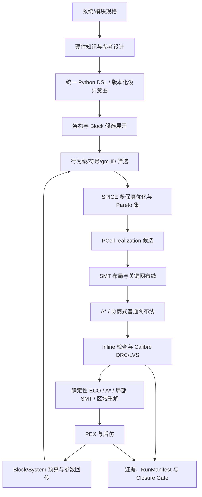

# AnalogSkills：面向模拟与混合信号电路的 DSL 驱动前后端协同设计框架

版本：2026-08-01 审计版

## 摘要

AnalogSkills 的目标不是用一个黑盒优化器替代模拟设计工程师，而是建立一套可表达设计意图、可注入硬件知识、可分层搜索、可在真实 PDK 上实现并由 foundry sign-off 工具验证的设计框架。框架覆盖三个尺度：

1. 模块级：对 OTA、比较器、Bandgap、LDO、采样器、VCO 等模块进行架构选择、器件尺寸优化和物理实现；
2. 系统级：对 ADC、PLL 等系统选择 architecture 和 block realization，分配指标预算并进行 block—system 联合优化；
3. 工艺级：通过统一 PDK/PCell/EDA 抽象面向 28nm、7nm 或后续工艺生成版图，并执行 DRC、LVS、PEX 和后仿闭环。

本次审计结论是：框架已经具备较强的固定架构模块优化、固定 ADC/PLL 层次实现、SMT/A* 布局布线、PCell realization、Calibre 驱动 ECO 和证据门禁能力；但此前缺少正式的架构候选、block 候选、跨层联合优化和多工艺 qualification DSL。本次已补充这些类型化能力、有界候选展开器，以及逐级 evaluator、硬指标门禁、Pareto 和 promotion dispatcher。尚未完成的关键工作是为全部模块建立标准 testbench/metric adapter，并把所有声明的数值优化算法接入统一执行器。7nm 当前也缺少 Spectre 与 Calibre collateral，因此不能宣称跨工艺 sign-off 已完成。

## 1. 问题定义

模拟设计自动化存在三个互相耦合的问题。

第一，电路架构和尺寸不能分开处理。一个指标可能通过增加电流、改变器件尺寸、改变补偿方式或直接更换架构实现。若只优化 W/L、nf 和 bias，而不允许更换 folded-cascode、two-stage、telescopic 等架构，优化器只能在一个局部空间内搜索。

第二，系统指标不是 block 指标的简单相加。ADC 的 SNDR、功耗、速度和面积由 sampler、DAC、comparator、reference、clock/logic 共同决定；PLL 的 jitter、lock time、spur 和功耗由 PFD、charge pump、loop filter、VCO、divider 共同决定。系统必须完成预算分配、block 选择、接口匹配和 bottom-up achievable envelope 回传。

第三，前端最优不等于可制造。尺寸必须映射到合法 PCell realization，布局必须满足匹配、对称、guard ring、共享扩散和 pin access，布线必须满足工艺规则，最终结果必须由目标 PDK 的 Calibre DRC/LVS/PEX 与后仿证据证明。

因此，完整问题是一个离散架构变量、连续/整数尺寸变量、离散 PCell realization、布局布线变量和工艺约束共同组成的多层优化问题。

## 2. 总体架构



DSL 是设计意图的唯一来源，PDK 和 EDA adapter 提供工艺与工具事实，求解器负责生成候选，observation 只报告约束、目标和实际结果，Agent 或优化调度器据此修改搜索策略或设计意图。

## 3. 硬件知识如何注入

“注入硬件知识”不应等价于在 Python 求解器里硬编码某一个 Bandgap 或 LDO 的坐标。知识分为五层：

1. 拓扑知识：合法 architecture、器件角色、接口、反馈环路和必要的电气结构；
2. 经验先验：gm/Id 优选区、器件比例、合理的补偿范围、参考设计统计和适用条件；
3. 评估知识：每个指标由哪个行为模型、符号模型、SPICE testbench 或后仿 evaluator 计算；
4. 物理知识：匹配、对称、邻近、common-centroid、guard ring、共享 S/D、pin access 和关键网；
5. 工艺知识：模型、corner、PCell 参数、calibrated realization、设计规则和 sign-off deck。

稳定的事实和不可违反的条件进入 hard domain/hard gate；经验进入带置信度和证据的 soft prior、preferred region 或优化目标。这样既能利用工程经验，又不把求解空间锁死。

## 4. 模块级自动设计

### 4.1 模块设计空间

模块 DSL 现在可以表达：

- `ArchitectureCandidateSpec`：候选架构、拓扑族、参数默认值、评估模型、所需能力、兼容 PDK 和参考证据；
- `ArchitectureSearchSpec`：架构筛选方法、目标、硬门禁、候选上限、Pareto 保留和 promotion evidence；
- `MetricSpec`：目标、上下界、权重、阶段、关联 knob 与 evaluator；
- `KnobSpec`：连续、整数、choice 或 PCell 变量的合法域；
- `KnobSearchPolicySpec`：经验优选域、先验、初始化和动态信赖域；
- `OptimizerPhaseSpec`：space-filling、代理模型、局部搜索及预算和 fallback；
- `OptimizationExperienceSpec`：带适用条件、置信度和 evidence 的可复用经验；
- `ProcessTargetSpec` 和 `SignoffClosureSpec`：目标工艺、所需能力和最终 closure 门禁。

### 4.2 推荐求解顺序

1. 由规格和硬件知识产生多个 architecture candidate；
2. 用行为级/符号模型做廉价可行性筛选；
3. 以 gm/Id 和参考设计生成初始点；
4. 在经验优选域内做 space-filling；
5. 用 SPICE evaluator 做 constrained optimization；
6. 保留满足硬指标的 Pareto 候选，而不是过早只保留一个 winner；
7. 为 Pareto 候选产生 PCell realization 和物理代价估计；
8. 对少量候选完成布局、布线、PEX 和 post-layout 回传；
9. 只有获得要求的 evidence 后才 promotion。

### 4.3 当前实现状态

基础模块图谱、拓扑评分、符号分析、gm/Id、黑盒优化、Spectre adapter、PCell 和后端 handoff 已存在。`coordinate_search` 和 `pattern_search` 有实际执行实现；Sobol、Bayesian optimization、CMA-ES 等目前可以被 DSL 正确描述和审计，但尚未全部接入统一策略调度器。因此模块级“固定拓扑自动优化”基本具备，“任意候选架构全自动仿真选优”仍是部分具备。

## 5. ADC/PLL 系统级设计

### 5.1 系统 DSL

系统 DSL 除原有 partition、budget、binding、critical path、floorplan 和 routing intent 外，新增：

- 多个 system architecture candidate；
- 同一 partition 的多个 block candidate；
- architecture/block/PDK 兼容关系；
- block 所需接口、指标、工艺能力、估计成本和 evidence；
- system/block 共享 knob；
- 分层优化 schedule、每层预算、收敛条件和 feedback path；
- 多工艺 target 与 sign-off closure policy。

`compile_design_space_contract()` 会有界展开“architecture × partition binding × process target”，过滤不兼容组合，检查 PDK capability 和 PCell family，并输出 `analogskills.architecture_block_process_design_space/v1`。组合爆炸由 `max_architecture_candidates` 和 `max_binding_combinations` 控制。

### 5.2 系统级优化循环

系统优化采用 top-down budget 与 bottom-up achievable envelope 双向迭代：

1. system behavioral model 根据 ENOB/SNDR、jitter、功耗、面积和速率产生 block budgets；
2. 为每个 partition 选择可实现的 block candidate；
3. block optimizer 返回性能、功耗、面积、接口范围和敏感度；
4. system evaluator 重新计算系统指标；
5. budget rebalance 只 retarget 主要瓶颈 block；
6. PCell/layout/PEX 结果回传真实面积、RC、matching 和电源完整性；
7. 若 block 已无法满足预算，则升级到 block replacement 或 architecture replacement。

ADC 的典型共享变量包括 sampling capacitor、comparator noise/offset budget、reference settling、clock phase 和 DAC segmentation。PLL 的典型共享变量包括 VCO gain、charge-pump current、loop-filter 参数、divider ratio、phase margin 和 spur budget。

### 5.3 当前实现状态

框架已有 pipeline ADC 和 charge-pump PLL 的层次图谱、budget rebalance、child retarget、top-level assembly/routing、verification closure 和多 cell writeback。此前 system template 只能绑定单一 block，本次已补上候选集合、组合展开和统一 dispatcher。dispatcher 已能按 `promotion_evidence` 顺序调用 behavioral、pre-layout、physical 或 sign-off evaluator，缺失 evaluator 时保持 pending，并对满足硬指标的候选计算 Pareto 和 promotion。当前剩余缺口是把所有 architecture/block 自动 materialize 为标准 testbench 和实现产物；因此执行内核已具备，具体设计 adapter 仍不完整。

本轮进一步建立了 `DesignSpaceEvaluatorRegistry` 和标准 adapter：拓扑图通过 `evaluate_topology` 接入 behavioral stage；经过 qualification 的 block metric catalog 可用于 architecture/block 评估；`SpectreEvaluatorPlan` 和 `EdaRunResult` 接入 pre-layout/post-layout stage；统一 physical contract 通过 `score_physical_implementation` 接入 physical stage；Calibre DRC/LVS artifact 通过现有 parser 接入 sign-off stage。四类 adapter 可以在同一个候选上连续执行，并保留各阶段 metrics、artifact、cost 和 evidence。剩余工作主要是为每种模块提供 plan builder、testbench 模板和可靠的 catalog 数据，而不是继续编写新的调度协议。

`QualifiedBlockCatalog` 进一步把候选库从临时 Python 字典升级为版本化资产。每个条目记录 block/template/architecture 身份、PDK 与 revision、端口接口、参数、PCell realization、适用系统、性能 envelope、标准 evaluation plan 和 typed evidence。qualification 是累积的：`characterized` 必须有该 PDK 的 passed Spectre pre-layout evidence，`physical_ready` 还必须有 passed Virtuoso layout evidence，`signoff_qualified` 还必须有该 PDK 的 passed Calibre DRC/LVS evidence 及报告内容哈希。缺少真实证据的声明既不能保存为有效 catalog，也不会被导出给 design-space evaluator。

`CandidatePlanBuilderRegistry` 使用稳定的 `builder_key` 将 catalog 中的声明映射到 testbench、物理实现或 Calibre artifact plan。`make_catalog_payload_builder()` 可把单 block 计划直接桥接到现有 Spectre/physical/Calibre adapter；如果一个系统候选解析出多个子 block 计划，它会明确要求系统级 aggregator，不会任意选择一个子计划并生成虚假系统 evidence。因此 DSL 负责表达设计意图和选项，catalog 负责提供经过证据约束的可复用实现，builder 负责生成执行计划，dispatcher 只负责多保真调度与 Pareto promotion。

首批标准模块接入覆盖 StrongARM comparator、two-stage OTA、Brokaw bandgap 和 PMOS-pass LDO。`standard_modules.py` 为每类模块定义稳定的接口、PCell family、适用系统、物理 planner，以及按电路语义拆分的 testbench/metric contract。例如 Bandgap 明确分为 temperature sweep、line/PSRR 和 startup；LDO 分为 loop stability、load/line transient 与 dropout/quiescent；这些 contract 只声明必须得到什么测量，不伪造测试平台。`ModulePlanContext` 必须提供已经物化的 Spectre deck 和 Calibre artifact，且 PDK/corner 必须与 catalog 一致，否则 plan 构建 fail-closed。

`execute_standard_module_physical_plan()` 已把现有 StrongARM hierarchical SMT、Bandgap/LDO device-level compact SMT 和 OTA sizing-layout backbone 接到统一 physical plan。SMT 结果明确标记为 early/device-level physical-planning evidence，不等同于 Virtuoso 或 Calibre qualification；每次结果同时报告 solver latency。接入过程中发现并修复了公共 SMT compiler 对新版 Z3 非法设置 `seed` 的兼容问题，并为 full compact flow 增加显式 solver timeout、candidate count 与 refinement count 参数，使 agent/dispatcher 可以在“完整求解”和“有界快速筛选”之间做可审计选择。

## 6. 多工艺、PCell 与 DRC/LVS Closure

### 6.1 工艺抽象

`PdkProfile` 将工艺接口分解为：

- layer、grid、width、spacing、enclosure、via 等规则；
- PCell template、calibration 和 realization catalog；
- Spectre model/corner；
- Virtuoso、Calibre DRC/LVS/PEX tool binding；
- shared diffusion 等特殊能力。

DSL 的 `ProcessTargetSpec` 不再只写一个工艺名字，而是声明 corners、所需 PCell family、required sign-off stage 和 capability。编译设计空间时，内置 PDK 的真实 registry capability 优先于 DSL 自报能力，避免用一段配置错误地宣称工具可用。

### 6.2 Closure 策略

建议使用分级修复：

1. generator/PCell 错误：重新生成；
2. width、area、enclosure 等单调问题：确定性 ECO；
3. 普通网局部阻塞：A* rip-up/reroute；
4. 多图形耦合 marker：局部 SMT；
5. access/corridor 与 placement 耦合：区域 SMT；
6. realization 或 floorplan 不可行：全局重解。

LVS 必须以 golden schematic/source netlist 为权威。辅助识别图形不得代替最终真实连接。每个 ECO candidate 必须同时检查 DRC 与 LVS，只有新 evidence 证明改善后才更新 accepted checkpoint。

### 6.3 当前工艺事实

截至本次审计：

- 28nm `crn28hpcp` profile 具备 layout、routing、PCell realization/calibration、shared diffusion、Spectre model、Calibre DRC 和 Calibre LVS binding；PEX binding 尚未配置；
- 7nm `tsmcn7` profile 目前具备 layout、routing、PCell template/calibration 接口，但没有已配置的 Spectre、Calibre DRC/LVS/PEX collateral，也没有已声明的 production PCell realization capability；
- 因此可以说框架接口支持 28nm/7nm，但只能对 28nm 的已配置阶段执行真实工具流程；不能宣称 7nm 已 DRC/LVS clean，也不能宣称当前任一工艺已完成 PEX sign-off，除非运行时另行提供并记录对应 collateral。

## 7. SMT、布线与 ECO 的职责边界

主 SMT 适合处理影响全局可行性的离散选择：PCell realization、器件 packing、匹配/对称、关键邻近、guard ring/共享扩散选择、通道容量、关键网 access 和关键规则。普通网使用 A*/协商式布线。density、局部 min-area 冗余填充和不改变拓扑的单调修复留给后处理。

把所有 foundry rule 都放入全局 SMT 会导致模型过大；完全不放规则又会产生不可修复的结构性错误。正确的分工是：主 SMT 保证结构性可行，inline checker 提前发现高频规则，Calibre 给出 sign-off marker，ECO 或局部 SMT 消除剩余问题。

## 8. Observation、Agent 与自动迭代

Observation 应输出事实而不是建议：

- 目标、硬/软约束及满足情况；
- 候选架构、block binding 和 PDK；
- 指标、置信区间、corner 与 evaluator provenance；
- 面积、利用率、空洞、对齐、对称、通道和 pin access；
- DRC marker family、位置、owner 和重复 fingerprint；
- LVS open/short/device/parameter 差异；
- 当前 active region、边界命中、stall 和预算消耗。

Agent 根据这些事实选择最小影响动作：调整 preferred region、切换 optimizer phase、替换 block、重新分配系统预算、扩大局部 SMT 窗口或升级工艺修复层级。每次修改必须形成版本化 DSL patch 和 checkpoint，下一轮用实际差异验证假设。

## 9. 能力审计

| 能力 | 当前状态 | 结论 |
|---|---|---|
| 基本模拟模块图谱与模板 | 已具备多类 OTA、比较器、Bandgap、LDO、ADC/PLL 子模块 | 满足基础覆盖，仍需继续扩展架构库 |
| 模块指标、knob、evaluator 与多保真阶段 | 已类型化并有执行组件 | 基本满足 |
| 模块多架构候选与选择契约 | 本次新增 architecture candidate/search | DSL 满足，统一自动执行器仍待完成 |
| 硬件经验注入 | topology、experience、preferred region、evidence、physical intent | 满足表达；经验库质量决定效果 |
| ADC/PLL 固定架构层次实现 | 已有预算、retarget、assembly、routing、closure | 基本满足 |
| ADC/PLL 自动 block 选择 | 已有 block candidate、有界展开、分级 evaluator、Pareto/promotion dispatcher | 执行内核满足，标准 block evaluator adapter 部分满足 |
| block—system 联合优化 | 新增 cross-level schedule、共享 knob、预算和反馈 DSL | 表达满足，统一调度执行部分满足 |
| PDK/PCell/EDA 抽象 | 28nm/7nm profile、PCell 和 EDA adapter | 接口满足 |
| 28nm DRC/LVS | collateral 已配置，closure/ECO 流程存在 | 可执行，但每个设计仍必须保留真实 clean evidence |
| 7nm DRC/LVS | collateral 未配置 | 不满足真实 sign-off |
| PEX/post-layout | 流程和契约存在，当前内置 PDK PEX binding 缺失 | 部分满足 |
| 证据与防误报 | ArtifactRef、RunManifest、closure gate、checkpoint | 满足基础要求 |

## 10. 新增 DSL 示例

```python
system = (
    system_template_dsl("adc_system", "adc_family")
    .objectives("sndr_db", "power_mw", "area_um2")
    .partition("sampler", "sampler", child_template_kind="bootstrapped_sampler")
    .partition("quantizer", "quantizer", child_template_kind="strongarm_comparator")
    .architecture_candidate(
        "sar", architecture_kind="sar_adc",
        partitions=("sampler", "quantizer", "dac", "logic"),
    )
    .block_candidate(
        "quantizer", "strongarm",
        template_kind="strongarm_comparator",
        supported_metrics=("offset", "delay", "power"),
    )
    .block_candidate(
        "quantizer", "double_tail",
        template_kind="double_tail_comparator",
        supported_metrics=("offset", "delay", "power"),
    )
    .architecture_search(
        objectives=("sndr_db", "power_mw", "area_um2"),
        hard_gates=("behavioral_feasible", "all_partitions_bound", "pdk_ready"),
    )
    .cross_level_optimization(
        system_metrics=("sndr_db", "power_mw"),
        block_metrics={"quantizer": ("offset", "delay")},
        shared_knobs=("comparator_noise_budget", "sampling_cap"),
        feedback_paths=("pex_to_system",),
    )
    .process_target(
        "28nm", pdk="crn28hpcp",
        required_capabilities=("spectre_models", "calibre_drc", "calibre_lvs"),
    )
    .signoff_closure(required_stages=("drc", "lvs"))
)
```

该 DSL 产生的是可审计设计空间，不是虚假的最终结论。候选只有在 evaluator、PCell、布局布线和 sign-off evidence 依次通过后才成为最终实现。

## 11. 后续实施优先级

P0：为 OTA、比较器、Bandgap、LDO、ADC 和 PLL block 补齐标准 plan builder、testbench/metric mapping，并注册到已实现的 topology/catalog/Spectre/physical/Calibre adapter；候选不得依赖设计专用回调才能执行。

P0：为模块模板增加标准 evaluator contract，要求每个 architecture candidate 明确输入、输出、corner、失败语义和缓存键。

P0：补齐 7nm Spectre、PCell realization 和 Calibre DRC/LVS collateral；在此之前保持 capability gate 失败。

P1：把 system cross-level schedule 接入现有 budget rebalance/child retarget 执行器，实现 architecture replacement、block replacement 和 sizing retarget 的统一升级策略。

P1：建立经过仿真与版图验证的 block catalog，记录性能 envelope、接口、面积、功耗、PCell/PDK compatibility 和 evidence hash。

P1：为 28nm 配置 PEX binding并完成 comparator、Bandgap、LDO、ADC/PLL 子系统的 post-layout regression。

P2：从参考设计和已完成 run 中抽取带条件与置信度的经验，持续校准 preferred region、候选 prior 和物理目标权重。

## 12. 结论

AnalogSkills 已经不是单一 SMT 布局脚本，而是具备统一设计意图、模块与系统层次、PCell/PDK/EDA 抽象、布局布线、DRC/LVS ECO、证据和回滚机制的前后端工具链。本次补充使 DSL 能正式表达三个核心问题：模块架构选择、系统 block 选择与联合优化、多工艺 sign-off qualification。

框架当前最重要的短板不再是“缺少字段”或“缺少 dispatcher”，而是“每类候选到真实多保真 evaluator 的标准 adapter 覆盖率”。下一阶段应减少新的描述层，重点完成 testbench/metric adapter、block catalog 和 7nm collateral，使通用调度内核转化为可重复、可验证的自动设计能力。
